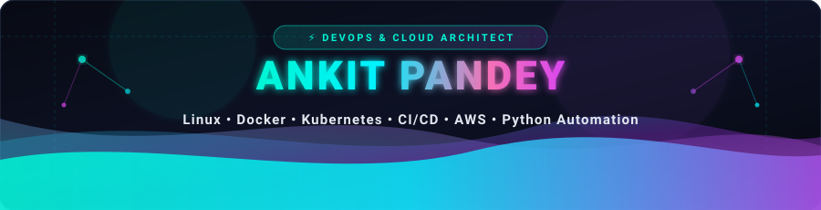

  

  

---

### 👨‍💻 About Me

- 🎓 Passionate **DevOps & Cloud Engineer** specializing in containerization, cloud infrastructure, and CI/CD pipelines.
- 💻 Hands-on experience with **Linux, Docker, Kubernetes, Jenkins, Vagrant, AWS, and Git/GitHub Actions**.
- 🚀 Building automated cloud workflows, Infrastructure as Code (IaC), and resilient deployment architectures.
- 🔭 Currently working on: **Cloud ETL Pipelines & Microservice Infrastructure Automation**.
- 📫 Reach me: [LinkedIn](https://www.linkedin.com/in/ankitpandey18) &bull; [Email](mailto:ankitpandeyboss36@gmail.com)
- ⚡ Philosophy: *If a task takes more than two clicks, automate it!*

---

### 🛠️ Tech Stack & Skills

  <b>Cloud, DevOps & Containers</b> 
  

  <b>Programming, Databases & Tools</b> 
  

---

### 📊 GitHub Activity & Streak

  

  

---

### 🐍 Contribution Activity Snake

  

---

### 🤝 Connect with Me

  &nbsp;&nbsp;
  &nbsp;&nbsp;
  

  

